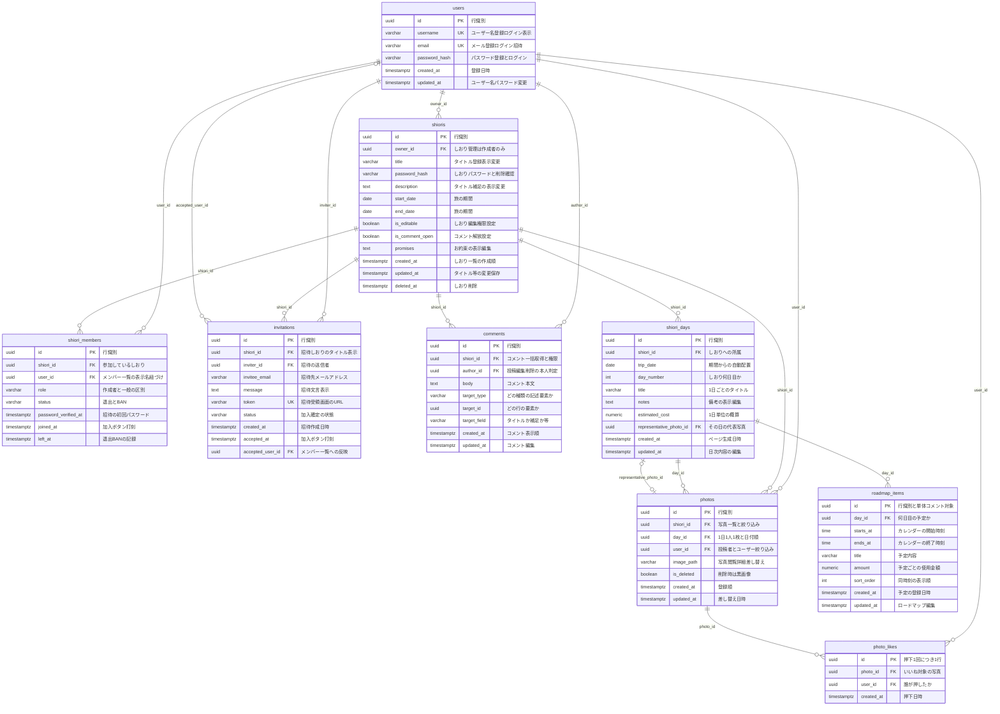
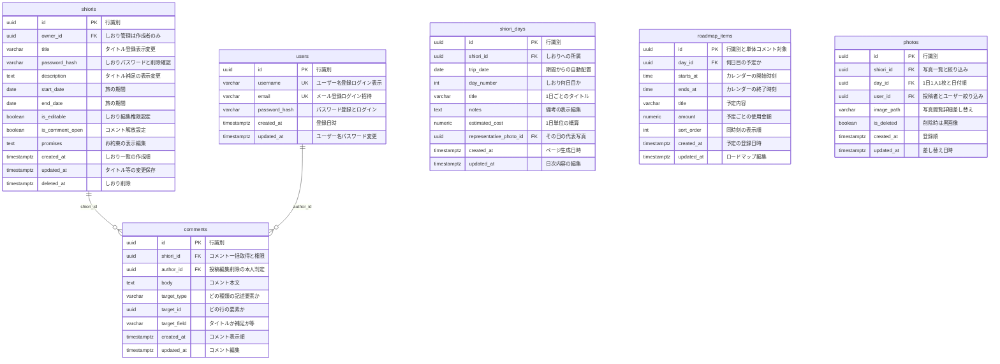

# しおりアプリ データベース設計

## 推奨 DBMS

**PostgreSQL** を推奨する。

| 理由                                     | 要件との対応             |
| -------------------------------------- | ------------------ |
| 外部キー・UNIQUE・CHECK が強い                  | 1日1人1枚、参加の一意、期間整合  |
| `date` / `numeric` / `timestamptz` が明確 | 旅の期間、概算費用、作成順      |
| 部分ユニーク索引が使える                           | 参加中メンバーのみ一意、など     |
| 論理削除と履歴を両立しやすい                         | 退出・BAN・写真削除（黒画像置換） |

ファイル保存（写真本体）は DB ではなくオブジェクトストレージ（S3 等）に置き、DB にはパスだけ持つ。
旧案との対比は [旧ER図との差分.md](./旧ER図との差分.md) を見る。

---

## ER 図（全体）

関係線のラベルは外部キー列名。エンティティ内は `型 カラム名 制約 "主な要件"`。

## カラムと主な要件

図中コメントの補足。`id` / `created_at` / `updated_at` は画面要件そのものではないが、識別・作成順・変更保存のために持つ。

---

### users

| カラム             | なぜ必要か                      | 主な要件                                    |
| --------------- | -------------------------- | --------------------------------------- |
| `id`            | 他テーブルからユーザーを参照する           | （識別子）                                   |
| `username`      | ログイン鍵かつメンバー一覧の表示名。設定から変更する | ユーザー名登録、メールまたはユーザー名でログイン、メンバー一覧、ユーザー名変更 |
| `email`         | ログイン鍵。招待の宛先にも使う            | メールアドレス登録、メールまたはユーザー名でログイン、招待           |
| `password_hash` | 平文を持たずにログイン認証する            | パスワード登録、パスワード入力、パスワード変更                 |
| `created_at`    | 登録時点を残す                    | アカウント新規登録                               |
| `updated_at`    | ユーザー名・パスワード変更の保存を検知する      | ユーザー名変更、パスワード変更                         |

### shioris

| カラム               | なぜ必要か               | 主な要件                            |
| ----------------- | ------------------- | ------------------------------- |
| `id`              | しおりを一意に識別する         | （識別子）                           |
| `owner_id`        | 管理画面を作成者だけに開く       | しおり管理は作成者のみ                     |
| `title`           | 一覧・招待・管理でタイトルを出す    | タイトル表示、タイトル登録、タイトル変更、招待時のタイトル表示 |
| `password_hash`   | 参加時と削除時に照合する        | しおりパスワード、招待時パスワード、しおり削除         |
| `description`     | 一覧の説明と管理画面の補足変更     | 説明表示、タイトル補足、補足変更                |
| `start_date`      | 期間表示と日次ページの生成開始     | 旅の予定期間表示、期間選択、期間変更、◯日目の自動配置     |
| `end_date`        | 期間表示と日次ページの生成終了     | 同上                              |
| `is_editable`     | 編集可否を管理者が切り替える      | しおり編集権限設定                       |
| `is_comment_open` | コメント機能の解放/未解放       | しおりコメント解放設定                     |
| `promises`        | 旅のルールを1か所で持つ        | お約束の表示編集                        |
| `created_at`      | しおりカードを作成順に並べる      | しおりカード表示（作成順）                   |
| `updated_at`      | タイトル等の変更保存          | タイトル変更、パスワード変更、補足変更、期間変更        |
| `deleted_at`      | 削除後もしばらく痕跡を残す（論理削除） | しおり削除                           |

### shiori_members

| カラム                    | なぜ必要か                   | 主な要件                 |
| ---------------------- | ----------------------- | -------------------- |
| `id`                   | 参加行を識別する                | （識別子）                |
| `shiori_id`            | どのしおりに参加しているか           | 参加しているしおりカード表示       |
| `user_id`              | メンバー一覧の名前を引く            | メンバー一覧               |
| `role`                 | 作成者（管理画面）と一般を分ける        | しおり管理は作成者のみ、管理者のみの設定 |
| `status`               | 参加中 / 退出 / BAN を行削除せず持つ | しおり退出操作、BAN          |
| `password_verified_at` | 招待後のパスワード確認を初回だけにする     | パスワード記入（初回のみ）        |
| `joined_at`            | 加入確定の打刻                 | 加入ボタン打刻              |
| `left_at`              | 退出・BAN の時点              | しおり退出操作、BAN          |

### invitations

| カラム                | なぜ必要か            | 主な要件             |
| ------------------ | ---------------- | ---------------- |
| `id`               | 招待を識別する          | （識別子）            |
| `shiori_id`        | 招待画面にタイトルを出す元    | しおりタイトル表示        |
| `inviter_id`       | 誰が招待したか          | 招待（メールアドレス利用）    |
| `invitee_email`    | 招待の宛先            | メールアドレス登録（招待に利用） |
| `message`          | 招待文言。空なら定型文      | 招待されています（文言表示）   |
| `token`            | 招待受領画面のURL       | 招待受領画面           |
| `status`           | 未加入 / 加入済 / 期限切れ | 加入ボタン打刻          |
| `created_at`       | 招待の作成時点          | 招待               |
| `accepted_at`      | 加入の打刻時刻          | 加入ボタン打刻          |
| `accepted_user_id` | 加入後にメンバー一覧へ載せる   | 加入ボタン打刻、メンバー一覧   |

### shiori_days

| カラム                       | なぜ必要か               | 主な要件            |
| ------------------------- | ------------------- | --------------- |
| `id`                      | 日次ページを識別する          | （識別子）           |
| `shiori_id`               | どのしおりの何日目か          | しおり内容           |
| `trip_date`               | 期間から日付を自動配置する       | しおり◯日目（期間で自動配置） |
| `day_number`              | 「1日目」などの表示          | しおり◯日目          |
| `title`                   | その日のタイトルを表示・編集する    | 1日ごとのタイトル       |
| `notes`                   | 何をするか・何を食べるかのメモ     | 備考              |
| `estimated_cost`          | 1日単位の概算。未入力なら予定金額合計 | 概算              |
| `representative_photo_id` | 全員の写真から1枚を代表にする     | 写真登録（管理者のみ代表選択） |
| `created_at`              | ページ自動生成の時点          | 期間に応じた自動生成      |
| `updated_at`              | 日次の編集保存             | タイトル・備考・概算などの編集 |

### roadmap_items

| カラム          | なぜ必要か                 | 主な要件                |
| ------------ | --------------------- | ------------------- |
| `id`         | 予定1件を識別し、単体コメントの対象にする | ロードマップ、記述要素への単体コメント |
| `day_id`     | どの日のカレンダーか            | ロードマップ              |
| `starts_at`  | 「21時の予定」など時刻指定        | カレンダー形式の予定登録        |
| `ends_at`    | 予定の終了時刻               | カレンダー形式の予定登録        |
| `title`      | 予定の内容                 | ロードマップ              |
| `amount`     | 予定ごとの使用金額             | 予定ごとに使用金額を設定        |
| `sort_order` | 同じ時刻の並び               | ロードマップ表示            |
| `created_at` | 予定の追加時点               | ロードマップ編集            |
| `updated_at` | 予定の変更                 | ロードマップ編集            |

### comments

| カラム            | なぜ必要か                | 主な要件                |
| -------------- | -------------------- | ------------------- |
| `id`           | コメントを識別する            | コメントの編集削除           |
| `shiori_id`    | しおり単位で一括取得し、権限を見る    | しおりコメント、コメント解放設定    |
| `author_id`    | 投稿者だけ編集・削除できるようにする   | コメントの投稿編集削除         |
| `body`         | コメント本文               | コメント表示・投稿           |
| `target_type`  | タイトルか予定か写真かを分ける      | 記述要素すべてへ単体コメント      |
| `target_id`    | 「21時の予定」など具体的な1件に付ける | 同上（ロードマップは予定1件単位）   |
| `target_field` | 同じ行のタイトルと補足を分ける      | タイトルとタイトル補足への個別コメント |
| `created_at`   | 要素の近くに出すときの並び        | コメント表示              |
| `updated_at`   | 編集の保存                | コメント編集              |

### photos

| カラム          | なぜ必要か               | 主な要件             |
| ------------ | ------------------- | ---------------- |
| `id`         | 写真を識別する。代表写真の参照先    | 写真閲覧・詳細、代表写真     |
| `shiori_id`  | しおりの写真一覧を出す         | 写真一覧、写真絞り込み      |
| `day_id`     | 1日1人1枚と日付順・日付絞り込み   | 写真登録、並び替え、絞り込み   |
| `user_id`    | 投稿者とユーザー絞り込み        | 1人1枚、ユーザーごとの絞り込み |
| `image_path` | グリッド表示・拡大・差し替えの実体パス | 写真閲覧、詳細、差し替え     |
| `is_deleted` | 行は残し、表示だけ黒い画像にする    | 写真削除             |
| `created_at` | 登録順の補助              | 写真登録             |
| `updated_at` | 差し替えの時点             | 写真差し替え           |

### photo_likes

押すたびに1行 INSERT する。同じユーザーが同じ写真に何度でも付けられる。写真1枚あたりの合計は **999まで**（アプリで拒否）。

| カラム          | なぜ必要か                         | 主な要件         |
| ------------ | ----------------------------- | ------------ |
| `id`         | 押下1回を識別する                     | いいねボタン（連打可）  |
| `photo_id`   | どの写真へのいいねか                    | いいねボタン       |
| `user_id`    | 誰が押したか（参加メンバー判定・誰が何回かの集計）     | いいねボタン       |
| `created_at` | 押下日時。いいね順は写真ごとの `COUNT(*)` で出す | 写真並び替え（いいね順） |

---

## 設計上の決めごと

### 作成者と管理者

- `shioris.owner_id` が **作成者**（しおり管理画面の閲覧者）。
- 作成者は `shiori_members.role = owner` でも持つ（メンバー一覧に出すため）。
- 要件上の「管理者」は当面 **作成者と同一** とする。代表写真の選定、編集権限・コメント解放の切替は owner のみ。

### 参加・退出・BAN

`shiori_members` は行を消さず `status` で持つ。

| status   | 意味   | しおり一覧                  |
| -------- | ---- | ---------------------- |
| `active` | 参加中  | 表示                     |
| `left`   | 自主退出 | 非表示                    |
| `banned` | BAN  | 非表示（再加入不可にするならアプリ側で判定） |

同一ユーザーの再参加に備えて `(shiori_id, user_id)` は一意のまま、status を `active` に戻す。

### 招待と初回パスワード

- 招待メールは `invitations.invitee_email`。加入確定で `shiori_members` を作る。
- `message` が NULL / 空ならアプリが定型文を出す（定型文はマスタ化しなくてよい）。
- しおりパスワード確認は **メンバー単位で初回のみ** → `password_verified_at`。

### 日次ページの自動生成

- `shiori_days` は `start_date`〜`end_date` の日付分を INSERT する。
- `day_number` は開始日を 1 日目とする連番。
- 期間変更時は、範囲外日を削除（または非表示）し、不足日を追加する。既存の予定・写真がある日は安易に消さない。

制約例:

- `end_date >= start_date`
- `UNIQUE (shiori_id, trip_date)`
- `UNIQUE (shiori_id, day_number)`

### 概算費用

- 予定ごとの金額は `roadmap_items.amount`。
- 1日の概算は `shiori_days.estimated_cost`。
- `estimated_cost` が NULL のときは `SUM(roadmap_items.amount)` を表示する（手入力と自動合計を両立）。

### 記述要素ごとの単体コメント

セクション（「ロードマップ全体」）ではなく、**画面に出ている記述要素 1 つにつきコメントスレッド 1 つ** とする。

例: 21時の予定へのコメントは、その `roadmap_items` 行だけに付く。22時の予定やタイトルには混ざらない。

`target_id` はポリモーフィック（実FKは張らない）。紐づけは `target_type` + `target_id` + `target_field`。

`comments` は次の 3 つで対象を一意に決める。

| カラム            | 役割        | 21時の予定の例                 |
| -------------- | --------- | ------------------------ |
| `target_type`  | どのテーブルか   | `roadmap_item`           |
| `target_id`    | どの行か      | その予定の `roadmap_items.id` |
| `target_field` | 同じ行のどの項目か | 予定は行ごとなので `NULL`         |

しおりタイトルとタイトル補足は同じ `shioris` 行にあるため、`target_field` で分ける。

| target_type    | target_id          | target_field           | 画面上の要素           |
| -------------- | ------------------ | ---------------------- | ---------------- |
| `shiori`       | `shioris.id`       | `title`                | しおりタイトル          |
| `shiori`       | `shioris.id`       | `description`          | タイトル補足           |
| `shiori`       | `shioris.id`       | `period`               | 旅の期間             |
| `shiori`       | `shioris.id`       | `promises`             | お約束              |
| `shiori_day`   | `shiori_days.id`   | `title`                | ◯日目のタイトル         |
| `shiori_day`   | `shiori_days.id`   | `notes`                | 備考               |
| `shiori_day`   | `shiori_days.id`   | `estimated_cost`       | 概算               |
| `shiori_day`   | `shiori_days.id`   | `representative_photo` | その日の代表写真         |
| `roadmap_item` | `roadmap_items.id` | `NULL`                 | 21時の予定など、予定1件    |
| `photo`        | `photos.id`        | `NULL`                 | 写真1枚（詳細の余白コメンxト） |

新しい記述要素を足すときは、このカタログに 1 行足すだけでコメント対象にできる。

制約:

- `target_type` は上記の値のみ（CHECK または ENUM）。
- `shiori` / `shiori_day` は `target_field` 必須。
- `roadmap_item` / `photo` は `target_field` を NULL に固定（要素＝行そのもの）。
- ポリモーフィックなので `target_id` に複数テーブル向けの FK は張れない。存在確認はアプリ、またはトリガーで行う。
- `shiori_id` は冗長カラム。ページ表示時に `WHERE shiori_id = ?` でコメントを一括取得し、`(target_type, target_id, target_field)` で各要素の横に振り分ける。
- コメント ON/OFF は `shioris.is_comment_open`。未解放なら投稿不可（既存コメントの表示可否はプロダクト判断）。
- 編集・削除は投稿者（必要なら owner）のみ。物理削除でよい。

予定行を消したときは、その `target_id` のコメントも一緒に消す（ON DELETE 相当をアプリまたはトリガーで行う）。

UI は各要素の横に ＋ を置き、投稿先をその要素の `(target_type, target_id, target_field)` にする。

### 写真

- `UNIQUE (day_id, user_id)` で **1日1人1枚** を保証する。
- 差し替えは同じ行の `image_path` を更新する。
- 削除は行を消さず `is_deleted = true`。表示時だけ黒い画像に差し替える。
- `shiori_id` は一覧・ユーザー絞り込みのための冗長カラム（`day` 経由でも辿れるが、写真一覧のクエリを単純にするため持つ）。
- いいねは `photo_likes` に **押下1回＝1行**。参加メンバーは同一写真へ何度でも押せる。写真ごとの合計 `COUNT(*)` が **999** に達したら追加不可（アプリ判定）。
- いいね順は写真ごとの `COUNT(*)`、日付順は `shiori_days.trip_date` + `photos.created_at`。
- いいねは取り消ししない（連打ノリのカウンター）。詳細画面は写真一覧から1枚を選んで表示する。

代表写真は `shiori_days.representative_photo_id`。その日の `photos` から 1 枚選ぶ。循環参照になるため、写真 INSERT 後に日次行を UPDATE する。

### パスワード

DB にはハッシュのみ保存する。英数字10文字以上はアプリのバリデーションで担保する（ハッシュ後は文字種を検証できない）。

しおり削除時のパスワード確認は `shioris.password_hash` と照合する。

---

## DDL 実装方針

実際に DDL（`CREATE TABLE` / `CREATE INDEX` など）を書くための前提とルールをまとめる。

### 共通ルール

- **DBMS / 拡張**
  - PostgreSQL を前提とする。
  - `uuid` のデフォルト値には `gen_random_uuid()`（`pgcrypto`）または `uuid_generate_v4()`（`uuid-ossp`）を利用する。
- **文字列型**
  - 長さ指定のない `varchar` は、特に理由がなければ `varchar(255)` とする。
  - 説明文・メッセージなどは `text` を使う。
  - `password_hash` も `varchar(255)` とし、文字数・文字種（英数字 10 桁以上）はアプリ側バリデーションで担保する。
- **NULL / NOT NULL**
  - 行識別や他テーブル参照、状態管理に必須のカラム（`id` / PK、FK、`status`、`role`、`target_type`、`target_id`、`body` など）は原則 `NOT NULL`。
  - 画面要件として「空欄可」の項目（タイトル補足、備考、概算など）は `NULL` 許可とする。
  - `created_at` は原則 `NOT NULL DEFAULT now()`。
  - `updated_at` は `NOT NULL` とし、`DEFAULT now()` を付けるかどうかはマイグレーション方針に合わせる（少なくともアプリ更新時には必ず更新する）。
  - `deleted_at` / `accepted_at` / `left_at` / `password_verified_at` など履歴用途の時刻は `NULL` 許可。
- **状態値の表現（ENUM / CHECK）**
  - PostgreSQL の ENUM 型は使わず、`varchar` + `CHECK` 制約で表現する。
  - 代表例:
    - `shiori_members.role IN ('owner', 'member')`
    - `shiori_members.status IN ('active', 'left', 'banned')`
    - `invitations.status IN ('pending', 'accepted', 'expired')`
    - `comments.target_type IN ('shiori', 'shiori_day', 'roadmap_item', 'photo')`
- **外部キーの動作**
  - 原則として `ON DELETE RESTRICT ON UPDATE CASCADE` とする。
  - 物理削除ではなく論理削除・アプリ側制御を前提とするため、自動 `ON DELETE CASCADE` は付けない。
  - もし特定のテーブルで CASCADE が必要になった場合は、そのテーブル定義側で個別に検討して追加する。

### テーブルごとの補足

- **users**
  - `id` / `username` / `email` / `password_hash` / `created_at` / `updated_at` は `NOT NULL`。
  - `username` / `email` は UNIQUE 制約を付ける。
- **shioris（しおり本体）**
  - しおり作成時に「タイトル」と「しおりパスワード」だけで登録できるようにする。
    - `title` / `password_hash` / `owner_id` / `created_at` / `updated_at` は `NOT NULL`。
    - `description` / `start_date` / `end_date` / `promises` / `deleted_at` は `NULL` 許可（あとから管理画面で編集）。
  - 編集権限・コメント解放フラグは `boolean NOT NULL DEFAULT true`。
  - 期間が両方入っている場合のみ整合性チェックを行う:  
    `CHECK (start_date IS NULL OR end_date IS NULL OR end_date >= start_date)`。
- **shiori_members**
  - `id` / `shiori_id` / `user_id` / `role` / `status` は `NOT NULL`。
  - `password_verified_at` / `joined_at` / `left_at` は `NULL` 許可。
  - `UNIQUE (shiori_id, user_id)` で同一ユーザーの重複参加を防ぐ。
  - `role` / `status` は上記の CHECK 制約で値域を縛る。
- **invitations**
  - `id` / `shiori_id` / `inviter_id` / `invitee_email` / `token` / `status` / `created_at` は `NOT NULL`。
  - `message` / `accepted_at` / `accepted_user_id` は `NULL` 許可。
  - `token` は UNIQUE。`status` は `'pending' / 'accepted' / 'expired'` のいずれかに制限する。
- **shiori_days**
  - `id` / `shiori_id` / `trip_date` / `day_number` / `created_at` / `updated_at` は `NOT NULL`。
  - `title` / `notes` / `estimated_cost` / `representative_photo_id` は `NULL` 許可。
  - 期間整合のため、設計で示した `UNIQUE (shiori_id, trip_date)` と `UNIQUE (shiori_id, day_number)` を必ず張る。
- **roadmap_items**
  - `id` / `day_id` / `starts_at` / `ends_at` / `title` / `created_at` / `updated_at` は `NOT NULL`。
  - `amount` / `sort_order` は「未設定可」として `NULL` 許可とする。
  - 必要に応じて `CHECK (ends_at IS NULL OR ends_at >= starts_at)` を追加してよい。
- **comments**
  - `id` / `shiori_id` / `author_id` / `body` / `target_type` / `target_id` / `created_at` / `updated_at` は `NOT NULL`。
  - `target_field` は、タイトル・補足など同一行内のどの項目かを区別するためのカラムで、  
    `target_type` が `shiori` / `shiori_day` のときは `NOT NULL`、`roadmap_item` / `photo` のときは `NULL` にする CHECK を付ける。
  - `target_type` 自体は上記の有限集合に `CHECK` で制限する。
- **photos**
  - `id` / `shiori_id` / `day_id` / `user_id` / `image_path` / `is_deleted` / `created_at` / `updated_at` は `NOT NULL`。
  - `is_deleted BOOLEAN NOT NULL DEFAULT false` とし、削除時は行を残して `true` に更新する。
  - `UNIQUE (day_id, user_id)` で 1 日 1 人 1 枚を保証する。
- **photo_likes**
  - `id` / `photo_id` / `user_id` / `created_at` は `NOT NULL`。
  - 押下 1 回につき 1 行 INSERT する。写真ごとの合計 999 件までという上限はアプリ側で制御し、DB では件数上限を持たない。

上記の方針に従えば、このドキュメントだけで PostgreSQL 向けの DDL（テーブル定義・制約・索引）を一貫したルールで作成できる。

---

## 索引（最低限）

| テーブル             | 索引                                       | 用途            |
| ---------------- | ---------------------------------------- | ------------- |
| `users`          | UNIQUE `username`, UNIQUE `email`        | ログイン          |
| `shiori_members` | UNIQUE `(shiori_id, user_id)`            | 重複参加防止        |
| `shiori_members` | `(user_id, status)`                      | 自分のしおり一覧      |
| `shiori_days`    | UNIQUE `(shiori_id, trip_date)`          | 日次ページ         |
| `photos`         | UNIQUE `(day_id, user_id)`               | 1日1人1枚        |
| `photos`         | `(shiori_id, user_id)`                   | ユーザー絞り込み      |
| `photo_likes`    | PK `id`、索引 `(photo_id, created_at)`    | 押下ログ・写真ごとの件数集計 |
| `photo_likes`    | `(photo_id, user_id)`                    | 誰が何回押したかの集計   |
| `invitations`    | UNIQUE `token`                           | 招待URL         |
| `comments`       | `(shiori_id, created_at)`                | しおり内コメントの一括取得 |
| `comments`       | `(target_type, target_id, target_field)` | 要素横への振り分け     |

しおり一覧（作成順）は `shiori_members` で `status = 'active'` を取り、`shioris.created_at` で並べる。