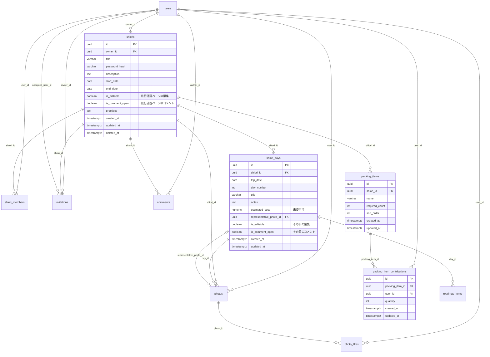

# フロント準拠のバックエンド／データベース調整方針

本ドキュメントは、**いまのフロントエンド（`frontend/`）の画面・操作・データ形を正**として、バックエンドとデータベースを合わせるために必要な実装とスキーマ修正を精査した結果である。

関連: [要件定義.md](./要件定義.md) / [アプリ概要_画面一覧.md](./アプリ概要_画面一覧.md) / [API設計.md](./API設計.md) / [データベース設計.md](./データベース設計.md)

| 項目 | 内容 |
|------|------|
| アーキテクチャ | **Next.js Java SPA Base**。画面は Next.js SPA、業務データは Java の REST API だけ。ブラウザから `/api` を呼ぶ |
| 方針 | フロントにある機能・データモデルにバックを合わせる。足りないテーブル／カラムは DDL を新しく書く |
| 対象フロント | Next.js App Router を **SPA シェル**として使う。現状はモック。API クライアントは未接続 |
| 対象バック | Spring Boot REST（`src/`）。JWT + JPA。`ddl-auto=validate`。唯一の API サーバ |
| 対象 DB | PostgreSQL。Next.js からは直接触らない。Java 経由のみ |

---

## 1. 結論

現行の [データベース設計.md](./データベース設計.md) のコア9テーブルだけでは、**フロントが既に動かしている機能を永続化できない。**

足りない／形が違う主な点は次のとおり。

1. **ページ別の編集権限・コメント解放**（旅行計画と各日で独立）
2. **持ち物の「担当数」**（1ユーザーが同一アイテムを複数個担当する）
3. **コメント対象の追加**（持ち物 `packing`、合算 `cost_summary`）
4. **しおり作成時の補足・期間と、日次ページの同時生成**
5. **期間変更に伴う日次の増減**
6. **写真の削除済み表示・一覧用の付加情報**（黒画像、投稿者名、日番号）
7. **招待の未ログイン取得**
8. 設計必須の **UNIQUE / CHECK / 索引**がエンティティに落ちておらず、実 DB の保証が取れない

したがって **目標スキーマを DDL として新しく定義し、既存テーブルは ALTER（または開発環境では作り直し）する。** バックエンド API も、パスは現行の `/api/shioris` を維持しつつ、**リクエスト／レスポンスと権限判定をフロントの型に合わせる。**

動かし方の前提は **Next.js Java SPA Base** である。Next.js は画面とクライアントからの REST 呼び出しだけを持ち、永続化も認可も Java REST が担う。Next.js の Route Handler / Server Actions / RSC で Java や DB を叩く構成にはしない。

フロントに無く、バックにだけある機能（日次の単独挿入 API、いいね解除、写真コメント専用パスなど）は、接続の必須範囲から外す。内部処理として残してよいものは後述する。

---

## 2. 原則

0. **Next.js Java SPA Base（最優先）。** 詳細は [§2.1](#21-nextjs-java-spa-base)。画面は Next.js、データは Java REST のみ。ブラウザから REST を呼ぶ。
1. **画面に出ている操作ができること**を API の合格条件とする。要件書にあってもフロントに無い操作は、必須実装にしない（ただし将来用にカラムを残す判断は個別に書く）。
2. **フロントの型（`frontend/types/index.ts`）を JSON の形の正**とする。フィールド名は camelCase。REST の JSON と 1:1 にする。
3. **画面の URL** は `/itineraries` など Next のルート。**REST の URL** は現行どおり `/api/shioris`。SPA の API クライアントで読み替える。Java 側パスを `itineraries` にリネームする作業は必須としない。
4. **しおり単位フラグだけでは足りない。** フロントの `ItineraryUiProvider` は「旅行計画」と「各日」で権限が分かれる。
5. データ破壊やオーナー不在など、フロントのモックが雑な箇所だけ例外を認める（[§5.11](#511-例外フロントを正にしないもの)）。
6. 写真本体はオブジェクトストレージ。DB はパスのみ。アップロードも **ブラウザ → Java REST（multipart）→ ストレージ** とし、Next.js を経由しない。

### 2.1 Next.js Java SPA Base

このアプリの実行形態は次で固定する。REST API 設計と矛盾する動かし方は採用しない。

```text
[ブラウザ]
    │  画面遷移は Next.js のクライアントルーティング
    │  データは fetch（Authorization: Bearer <JWT>）
    ▼
[Next.js]  …… UI シェル（HTML/CSS/JS）。業務 API を持たない
    │  （任意）同一オリジンに見せるための /api リバースプロキシだけ
    ▼
[Java Spring]  …… 唯一の REST サーバ。認可・バリデーション・永続化
    ▼
[PostgreSQL] / [オブジェクトストレージ]
```

| 層 | やってよいこと | やってはいけないこと |
|----|----------------|----------------------|
| Next.js | 画面、クライアント hooks、`lib/api` からの REST 呼び出し、JWT の保持 | `app/api/**` の Route Handler で業務 API を実装する。Server Actions で DB / Java を叩く。RSC がモック以外の業務データを読む。Prisma 等で DB 直結 |
| ブラウザ | `GET/POST/PATCH/DELETE /api/...`、multipart 写真、未ログインの招待 GET | Cookie セッションを Next サーバだけが知る形にして、RSC 経由で Java を呼ぶ |
| Java | `/api` 配下の REST、JWT 検証、CORS またはリバースプロキシ先 | Next 専用の HTML レンダリング、画面ごとの BFF |
| DB | Java からのみ | Next.js からの直接接続 |

**同一オリジンにする場合**（推奨。開発でも CORS 事故を減らせる）:

- Next の `rewrites` で `/api/:path*` → `http://localhost:8080/api/:path*` のように **プロキシするだけ**。
- ブラウザから見ると常に同じオリジンの `/api`。中身は Java REST のまま。
- プロキシは転送であり、Next 側でレスポンスを組み立て直さない。

**オリジンを分ける場合**: Java の CORS をフロント origin に限定し、`Authorization` と `Content-Type`、multipart を許可する。Cookie 認証にはしない（JWT をヘッダで送る SPA）。

**JWT の置き場**: ブラウザ（`localStorage` またはメモリ）。すべての認証付き REST に `Authorization: Bearer` を付ける。httpOnly Cookie にすると RSC / BFF 前提になり、本方針から外れる。

**データ取得の置き場**: ページや hooks（クライアント）が REST を呼ぶ。UI コンポーネントは props を受け取る（[コンポーネント一覧.md](./コンポーネント一覧.md) の「コンポーネントは API を直接呼ばない」と両立する）。差し替え対象はモック関数 → `lib/api` の REST 呼び出しである。

**合格条件**: Java を起動し、Next の dev / 静的に近いクライアント遷移だけで、ログイン〜しおり編集〜写真〜招待加入まで通る。Next を止めて Java の `/api` を curl しても同じ契約で動く。

#### いまのフロントで SPA Base を阻んでいる点

接続作業で直す。バックの DDL より前でも方針として固定する。

| 現状 | 問題 | SPA Base での直し方 |
|------|------|---------------------|
| `app/itineraries/[id]/layout.tsx` が **async Server Component** で `getMockItineraryById` | サーバがデータを持っている。JWT はブラウザにしか無いので、このまま REST に差し替えられない | Client Provider。マウント後に `GET /api/shioris/{id}` と days を呼ぶ |
| `app/invitations/[code]/page.tsx` が async Server Component | 未ログイン招待 GET をサーバで読む形になりやすい | Client Page。`GET /api/invitations/{token}` をブラウザから（認証ヘッダなし） |
| `app/settings/page.tsx` がサーバで `mockCurrentUser` を埋め込み | 同上 | Client。`GET /api/users/me` |
| `next.config.ts` に rewrite も API ベース URL も無い | ブラウザが Java の origin を知らない | `NEXT_PUBLIC_API_BASE_URL` または `/api` rewrite |
| `frontend/app/api` は未作成 | 今後 Route Handler を足したくなる | **作らない。** 業務 API は Java のみ |
| ログイン成功が `router.push` のみ | REST していない | `POST /api/auth/login` → token 保存 → 一覧 |

ログイン・新規登録の **ページ自体** が Server Component なのは、データ fetch をしていなければ SPA として問題ない。フォームは既に `"use client"` なので、そこから REST を呼べばよい。

---

## 3. フロント機能インベントリ（正）

実装の参照先。権限の `canEdit` / `canComment` は、見ているページのキー（旅行計画 or その日）に対する値である。作成者（`isOwner`）は常に編集可。コメントは作成者でも、そのページのコメントがオフなら UI 上は出さない（`canComment` は `isOwner` を加味していない）。

### 3.1 認証・アカウント

| 画面 | 操作 | 永続化 |
|------|------|--------|
| `/signup` | ユーザー名 / メール / パスワード（10文字以上） | `users` INSERT |
| `/login` | メールまたはユーザー名 + パスワード | JWT 発行 |
| `/settings` | ユーザー名変更 | `users.username` |
| `/settings` | パスワード変更（現在＋新規） | `users.password_hash`。現在パスワード照合が必要 |
| `/settings` | ログアウト（確認モーダル） | クライアントのトークン破棄。サーバは 204 でよい（ブラックリスト必須ではない） |

### 3.2 しおり一覧・作成・退出

| 画面 | 操作 | 永続化 |
|------|------|--------|
| `/itineraries` | 参加中しおりを **作成順** で表示。カードにタイトル・補足・期間 | `shiori_members.status=active` JOIN `shioris`。`description` が必要 |
| 同上 | カードに作成者かどうか（表紙・退出の出し分けに使う想定） | レスポンスに `isOwner` |
| 作成モーダル | タイトル必須、パスワード英数字10文字以上、補足任意、期間任意（両方あるとき終了≥開始） | 1リクエストでしおり＋オーナー参加＋（期間があれば）日次生成 |
| 退出 | 確認後に一覧から消す | `status=left`。**作成者は不可**（例外） |

### 3.3 旅行計画ページ（しおり本の先頭見開き）

左: 期間ラベル、タイトル、補足、お約束、合算。右: 持ち物。

| 要素 | 表示 | 編集 | コメント `target_field` |
|------|------|------|-------------------------|
| 期間 | 開始〜終了。このページでは編集しない（管理画面） | — | `period` |
| タイトル | しおりタイトル | 旅行計画の `canEdit` | `title` |
| 補足 | description | 同上 | `description` |
| お約束 | 複数行 | 同上 | `promises` |
| 合算 | 各日のロードマップ金額合計。**手入力しない** | なし | `cost_summary`（しおり単位） |
| 持ち物 | 行の追加・名前・必要数×N・担当 | リスト編集は `canEdit`。**チェック（担当数）は編集オフでもメンバー可** | `packing` |

持ち物の担当モデル（フロントの正）:

- アイテムごとに `requiredCount`（1以上）
- ユーザーごとに `quantity`（1以上）。同一ユーザーが複数個担当できる
- クリック: 未参加なら +1、参加中なら自分の数量 +1、必要数を超えそうなら **自分の担当だけ削除**
- 他人の担当合計が必要数に達していると、未参加ユーザーはクリック不可
- 持ち物行は最大 99。空ラベル + Backspace で行削除
- 表示は `たろう×2、はなこ×1 （3/4）`

これは現行バックの「ユーザー1人1チェック行（数量なし）」では表現できない。

### 3.4 日ごとページ

| 要素 | 表示 | 編集 | コメント |
|------|------|------|----------|
| ◯日目 + 日タイトル | 左ページ先頭 | その日の `canEdit` | **フロントにコメント UI なし** |
| 代表写真 | その日の写真から1枚 | **作成者のみ**選定 | `shiori_day` / `representative_photo` |
| 備考 | 複数行 | その日の `canEdit` | `notes` |
| ロードマップ | 開始時刻・内容・任意の金額。終了時刻 UI なし | その日の `canEdit`。Enter で行追加、空タイトル Backspace で削除 | 予定1件単位。`target_field` なし |

費用: 日次の手入力概算 UI は無い。旅行計画の合算がロードマップ金額の SUM。`ShioriDay.estimatedCost` はモックに残っているが画面では使わない。

### 3.5 写真一覧（モーダル／専用ページ）

| 操作 | フロントの挙動 |
|------|----------------|
| グリッド | 横3列。削除済みは黒（「削除済みも見る」がオンのとき） |
| 並び替え | 日付順（日番号→登録日時）／いいね順 |
| 絞り込み | 自分のみ、いいね付き（`likeCount > 0`）、日ごと、削除済みも見る |
| 登録 | 選択中の日（未選択なら1日目）。**同一ユーザー・同一日に未削除が既にあると拒否**。差し替えは詳細から |
| 差し替え | 投稿者本人または作成者 |
| 削除 | 同上。行は残し `isDeleted=true`（黒画像） |
| いいね | 連打可、上限 999。解除 UI なし |
| コメント | 詳細の余白。解放は **旅行計画ページのコメント設定**（日ごとではない） |

アップロードは `canEdit` を見ていない。参加メンバーなら登録できる。

### 3.6 しおり管理（作成者のみ。モーダル／専用ページ）

| 操作 | 内容 |
|------|------|
| ページ別権限 | 旅行計画＋各日について「編集を許可」「コメント機能」を即時トグル |
| メンバー一覧 | 表示名と役割。作成者以外を BAN（確認モーダル）。対象は **userId** |
| しおり設定 | タイトル、パスワード、補足、期間を保存 |
| 削除 | しおりパスワード入力＋確認 |

招待の **作成 UI はフロントに無い。** 加入画面（`/invitations/[code]`）はある。

### 3.7 招待受領

未ログインでもタイトル・文言を表示する画面。パスワード＋加入。加入後はしおり内容へ。文言が空なら定型文。

加入そのものは認証必須（設計どおり）。画面表示用の GET は認証不要。

### 3.8 権限の実体（フロント）

```
旅行計画: PLAN_PERMISSION_KEY = "plan"
各日:     shiori_days.id
```

初期値はしおりの `isEditable` / `isCommentOpen` を全ページにコピーし、管理画面でページごとに上書きする。  
現行 DB のしおり単位2フラグだけでは、保存できない。

---

## 4. 現行 DB / API との差分

### 4.1 テーブル

| 対象 | 現行設計 | フロントが必要とするもの | 判定 |
|------|----------|--------------------------|------|
| コア9テーブル | あり | あり | 残す。制約を DDL で明示 |
| ページ権限 | しおりの2フラグのみ | 旅行計画＋日ごと | **日次にフラグ追加**（しおり側フラグは旅行計画用として再利用） |
| 持ち物マスタ | 設計書に無し。JPA に `packing_items` | あり | **設計に正式追加** |
| 持ち物担当 | JPA の `packing_item_checks`（0/1） | `quantity ≥ 1` | **テーブルを作り直す**（後述） |
| コメント対象 | packing / cost_summary なし | 両方あり | CHECK とアプリ検証を拡張 |
| ロードマップ終了時刻 | `ends_at NOT NULL` | UI なし（任意） | **NULL 許可** |
| 写真削除済み | 行は残す設計 | 一覧に含めて黒表示 | 一覧 API が除外しているのをやめる |

### 4.2 API・権限でフロントと食い違う点

| 項目 | フロント | 現行バック | 合わせ方 |
|------|----------|------------|----------|
| しおり作成 | タイトル・PW・補足・期間を一度に | タイトル・PW のみ。期間は別 PATCH かつ日次があると変更不可 | 作成1本にまとめる。期間変更も実装 |
| タイトル等の編集 | 旅行計画の `canEdit` ならメンバーも可 | 作成者のみ `updateShiori` | 項目ごとに権限を分ける |
| BAN | `userId` | メンバー行 `memberId` | **userId** に合わせる |
| ログイン JSON | `loginId` 相当 | `usernameOrEmail` | `loginId` を受け取る |
| パスワード変更 | 現在のパスワード必須 | 現在確認なし | 確認を必須に |
| 招待表示 | 未ログイン GET | エンドポイントなし | 公開 GET を追加 |
| 写真一覧 | 削除済み含む、名前、日番号、ソート | 削除除外、パスのみ | レスポンス拡張。ソートはサーバでも可 |
| 写真登録 | 編集ロックと無関係 | `is_editable` でないと不可 | メンバーなら可 |
| 代表写真 | 作成者のみ | 編集可メンバーなら可 | 作成者のみ |
| コメント取得・投稿 | メンバー限定の想定 | メンバー判定なし | 必須で入れる |
| いいね解除 | なし | なし | 作らない |
| 日次の単独 insert/delete | UI なし | API あり | 期間変更の内部処理に使う。公開必須ではない |

---

## 5. 決めた仕様（フロント準拠）

### 5.1 権限

| 操作 | 誰が可 |
|------|--------|
| 閲覧（しおり・日・写真・コメント・持ち物） | 参加中メンバー |
| 旅行計画のタイトル・補足・お約束・持ち物マスタ（追加／改名・必要数／削除） | 作成者、または旅行計画の編集 ON |
| その日のタイトル・備考・ロードマップ | 作成者、またはその日の編集 ON |
| 持ち物の担当クリック（数量の増減・解除） | 参加中メンバー（編集 OFF でも可） |
| 写真の登録 | 参加中メンバー（1日1人1枚。削除済みなら同じ行を復活） |
| 写真の差替・削除 | 投稿者本人または作成者 |
| いいね | 参加中メンバー。同一写真に何度でも。合計 999 |
| コメント投稿 | その対象が属するページのコメント ON（写真コメントは旅行計画のコメント ON） |
| コメント編集 | 投稿者本人 |
| コメント削除 | 投稿者本人（作成者も可としてよい。フロントは本人編集が主） |
| 代表写真の選定 | 作成者のみ |
| ページ別権限・BAN・しおりPW・期間・しおり削除・招待作成 | 作成者のみ |
| 退出 | 作成者以外の参加中メンバー |

コメント閲覧: コメント OFF のページでも、メンバーなら既存コメントを API で返してよい。UI が出さないだけ。OFF 時の投稿は 403。

### 5.2 しおり作成と期間

- 作成 API は `title`, `password`, `description?`, `startDate?`, `endDate?` を受け取る。
- 日付は **両方あるか、両方ないか。** 片方だけは 400。
- 両方ある場合、その日数分 `shiori_days` を作り、各日の権限フラグは `true` 初期値。
- 両方ない場合、日次は空。管理画面で期間を初めて保存したときに生成する。

期間変更（作成者）:

- 終了を延ばす → 末尾に日を足す。新日の権限は `true`。
- 終了を縮める / 開始を後ろへ → 範囲外の日を削除。紐づくロードマップ・写真いいね・コメントも削除（RESTRICT を避けるためアプリ側で子から消す）。
- 開始を前へ → 先頭に日を足し、既存の `day_number` / `trip_date` をずらす。
- `end < start` は 400。
- フロントに「データが消える」警告は無いが、API は通常の保存として実行する（管理画面の期間保存がトリガ）。

### 5.3 合算と日次概算

- 表示は常に `SUM(roadmap_items.amount)`（NULL は 0）。
- `shiori_days.estimated_cost` は互換のため残すが、フロントは読まない・書かない。手入力更新 API は必須にしない。

### 5.4 ロードマップ

- `starts_at` 必須。`ends_at` は NULL 可（フロントは送らない）。
- `title` は空文字を許可（入力途中の行がある）。
- 表示順は `sort_order`（同日内の 0,1,2…）。フロントの配列順を保存する。
- 金額は任意。

### 5.5 持ち物

- マスタ: `name`（フロントの `label`）、`required_count`、`sort_order`。
- 担当: `(packing_item_id, user_id)` 一意。`quantity ≥ 1`。
- 制約: 担当数量の合計 ≤ `required_count`（アプリで保証。可能なら DB のトリガは任意）。
- クリック1回の API は「自分の quantity を +1、上限なら自分の行を DELETE」がフロントと一致する。専用の cycle エンドポイントを推奨。
- マスタ上限 99 件。

### 5.6 コメント

`target_type` + `target_id` + `target_field`。本文は **最大 20 文字**（フロント `COMMENT_MAX_LENGTH`。書記素単位に近いのでアプリで `codePoint` カウント。DB は `text` + アプリ検証）。

| target_type | target_id | target_field | 画面 |
|-------------|-----------|--------------|------|
| `shiori` | しおり ID | `title` | タイトル |
| `shiori` | しおり ID | `description` | 補足 |
| `shiori` | しおり ID | `period` | 期間ラベル |
| `shiori` | しおり ID | `promises` | お約束 |
| `shiori` | しおり ID | `packing` | 持ち物ブロック |
| `shiori` | しおり ID | `cost_summary` | 合算ブロック |
| `shiori_day` | 日 ID | `notes` | 備考 |
| `shiori_day` | 日 ID | `representative_photo` | 代表写真 |
| `shiori_day` | 日 ID | `title` | （フロント未使用。許可は残す） |
| `roadmap_item` | 予定 ID | NULL | 予定1件 |
| `photo` | 写真 ID | NULL | 写真詳細 |

レスポンスに `authorName` を含める（JOIN `users.username`）。

### 5.7 写真

- `UNIQUE (day_id, user_id)` は削除済み行も含めて維持。差し替え・再登録は **同じ行を更新**（`image_path` 更新、`is_deleted=false`）。
- 一覧はデフォルトで削除済みを含めて返し、フロントが `includeDeleted` で隠す。または `includeDeleted` クエリをサーバで見てもよい。
- レスポンス: `id`, `dayId`, `dayNumber`, `userId`, `userName`, `imageUrl`, `isDeleted`, `likeCount`, `createdAt`。
- いいね解除 API は作らない。

### 5.8 招待

- `GET /api/invitations/{token}` は認証不要。タイトル、文言、status。期限切れ UI はフロントに分岐が無いので、`expires_at` は今回追加しない。status は `pending` / `accepted` で足りる（`expired` は型互換のため CHECK には残してよい）。
- `POST .../accept`（または `/join`）は認証必須 + しおりパスワード。
- 招待作成 API はフロントにボタンが無いが、加入にトークンが必要なので **残す**（作成者のみ）。

### 5.9 認証 JSON

- ログイン: `{ "loginId": "...", "password": "..." }` → `{ "token": "..." }`
- 新規登録成功: `201`
- 重複: `409`
- ログイン失敗: `401`
- ユーザー更新: 名前は `PATCH /api/users/me`。パスワードは現在パスワード付き。フロントは別フォームなので、1エンドポイントで部分更新でも、パスワード専用でもよい。パスワード変更時は `currentPassword` 必須。

### 5.10 しおりパスワード

- 作成・変更・削除確認・招待加入で使う。英数字10文字以上（フロントの作成フォームと同じ）。
- 管理画面のパスワード欄は「変更するときだけ送る」。空なら更新しない。

### 5.11 例外（フロントを正にしないもの）

| 例外 | 理由 | 対応 |
|------|------|------|
| 作成者の退出 | オーナー不在のしおりが残る。バックは既に拒否 | API は 400 のまま。フロントは `isOwner` のとき退出ボタンを出さない |
| 日次の単独挿入 UI | フロントに無い | 期間変更の内部でのみ日を増減する |
| いいね解除 | フロントに無い | API を増やさない |

---

## 6. データベース修正一覧

### 6.1 既存テーブルへの ALTER（論理）

| テーブル | 変更 |
|----------|------|
| `shiori_days` | `is_editable boolean NOT NULL DEFAULT true`、`is_comment_open boolean NOT NULL DEFAULT true` を追加。旅行計画用フラグは従来どおり `shioris` 側 |
| `roadmap_items` | `ends_at` を NULL 許可。`sort_order` を `NOT NULL DEFAULT 0` に寄せる |
| `comments` | `target_field` の CHECK を拡張（`packing`, `cost_summary`） |
| `shioris` | 期間 CHECK、論理削除の運用はそのまま。一覧用に `description` は既にある |
| `photos` | カラム追加は不要。UNIQUE と `is_deleted` を DDL で保証 |
| `packing_item_checks` | **廃止。** 担当は新テーブルへ |

`shioris.is_editable` / `is_comment_open` の意味を **「しおり全体」から「旅行計画ページ」** に再定義する。マイグレーション時、既存の日次行には同じ値をコピーして初期化する。

### 6.2 新規テーブル

**`packing_items`**（設計書未記載だが JPA に既にある。DDL に正式化）

- しおりに紐づく持ち物マスタ。

**`packing_item_contributions`**（`packing_item_checks` の置き換え）

- `(packing_item_id, user_id)` UNIQUE
- `quantity integer NOT NULL CHECK (quantity >= 1)`

既存の `packing_item_checks` がある環境では:

```text
各行を quantity=1 の contribution にコピー → checks を DROP
```

### 6.3 必ず張る UNIQUE / CHECK / 索引

現行エンティティに無く、フロントの不変条件を守るために DDL 必須。

| 制約 | 目的 |
|------|------|
| `UNIQUE (shiori_id, user_id)` on `shiori_members` | 重複参加防止。再参加は status を戻す |
| `UNIQUE (shiori_id, trip_date)` / `UNIQUE (shiori_id, day_number)` on `shiori_days` | 日次の一意。日のシフトは flush 順に注意 |
| `UNIQUE (day_id, user_id)` on `photos` | 1日1人1枚（削除済み行も含む） |
| `UNIQUE (token)` on `invitations` | 招待 URL |
| `UNIQUE (packing_item_id, user_id)` on contributions | 担当はユーザー1行 |
| CHECK `role` / `status` / `target_type` / 期間 | 不正値の防止 |
| 索引 `shiori_members (user_id, status)` | 自分のしおり一覧 |
| 索引 `comments (shiori_id, created_at)` および `(target_type, target_id, target_field)` | 一括取得と要素横への振り分け |
| 索引 `photo_likes (photo_id)` | 件数集計 |
| 索引 `photos (shiori_id)` | 写真一覧 |

外部キーは `ON DELETE RESTRICT ON UPDATE CASCADE`（現行設計どおり）。しおり論理削除後も行は残る。子の物理削除はアプリが先に行う。

代表写真の循環参照（`shiori_days.representative_photo_id` ↔ `photos`）は、日次削除時に先に FK を NULL にする。DDL では `representative_photo_id` に FK を張ってよい。

---

## 7. 目標 ER（フロント準拠後）



コアの `users` / `shiori_members` / `invitations` / `roadmap_items` / `comments` / `photos` / `photo_likes` の関係は現行設計と同じ。コメントの `target_field` だけ拡張する。

---

## 8. 目標 DDL（PostgreSQL）

開発環境はこれで作り直してよい。既存がある場合は同等の ALTER に分解する。  
拡張: `pgcrypto`（`gen_random_uuid()`）。

```sql
-- しおりアプリ 目標スキーマ（フロント準拠）
-- PostgreSQL

CREATE EXTENSION IF NOT EXISTS pgcrypto;

-- ---------------------------------------------------------------------------
-- users
-- ---------------------------------------------------------------------------
CREATE TABLE users (
    id              uuid PRIMARY KEY DEFAULT gen_random_uuid(),
    username        varchar(50)  NOT NULL,
    email           varchar(255) NOT NULL,
    password_hash   varchar(255) NOT NULL,
    created_at      timestamptz  NOT NULL DEFAULT now(),
    updated_at      timestamptz  NOT NULL DEFAULT now(),
    CONSTRAINT users_username_key UNIQUE (username),
    CONSTRAINT users_email_key UNIQUE (email)
);

-- ---------------------------------------------------------------------------
-- shioris
-- is_editable / is_comment_open は「旅行計画」ページの権限
-- ---------------------------------------------------------------------------
CREATE TABLE shioris (
    id                uuid PRIMARY KEY DEFAULT gen_random_uuid(),
    owner_id          uuid         NOT NULL REFERENCES users (id) ON DELETE RESTRICT ON UPDATE CASCADE,
    title             varchar(255) NOT NULL,
    password_hash     varchar(255) NOT NULL,
    description       text,
    start_date        date,
    end_date          date,
    is_editable       boolean      NOT NULL DEFAULT true,
    is_comment_open   boolean      NOT NULL DEFAULT true,
    promises          text,
    created_at        timestamptz  NOT NULL DEFAULT now(),
    updated_at        timestamptz  NOT NULL DEFAULT now(),
    deleted_at        timestamptz,
    CONSTRAINT shioris_period_chk CHECK (
        start_date IS NULL OR end_date IS NULL OR end_date >= start_date
    )
);

CREATE INDEX shioris_owner_id_idx ON shioris (owner_id);
CREATE INDEX shioris_created_at_idx ON shioris (created_at);

-- ---------------------------------------------------------------------------
-- shiori_members
-- ---------------------------------------------------------------------------
CREATE TABLE shiori_members (
    id                     uuid PRIMARY KEY DEFAULT gen_random_uuid(),
    shiori_id              uuid        NOT NULL REFERENCES shioris (id) ON DELETE RESTRICT ON UPDATE CASCADE,
    user_id                uuid        NOT NULL REFERENCES users (id) ON DELETE RESTRICT ON UPDATE CASCADE,
    role                   varchar(20) NOT NULL,
    status                 varchar(20) NOT NULL,
    password_verified_at   timestamptz,
    joined_at              timestamptz,
    left_at                timestamptz,
    CONSTRAINT shiori_members_shiori_user_key UNIQUE (shiori_id, user_id),
    CONSTRAINT shiori_members_role_chk CHECK (role IN ('owner', 'member')),
    CONSTRAINT shiori_members_status_chk CHECK (status IN ('active', 'left', 'banned'))
);

CREATE INDEX shiori_members_user_status_idx ON shiori_members (user_id, status);

-- ---------------------------------------------------------------------------
-- invitations
-- ---------------------------------------------------------------------------
CREATE TABLE invitations (
    id                 uuid PRIMARY KEY DEFAULT gen_random_uuid(),
    shiori_id          uuid         NOT NULL REFERENCES shioris (id) ON DELETE RESTRICT ON UPDATE CASCADE,
    inviter_id         uuid         NOT NULL REFERENCES users (id) ON DELETE RESTRICT ON UPDATE CASCADE,
    invitee_email      varchar(255) NOT NULL,
    message            text,
    token              varchar(255) NOT NULL,
    status             varchar(20)  NOT NULL,
    created_at         timestamptz  NOT NULL DEFAULT now(),
    accepted_at        timestamptz,
    accepted_user_id   uuid REFERENCES users (id) ON DELETE RESTRICT ON UPDATE CASCADE,
    CONSTRAINT invitations_token_key UNIQUE (token),
    CONSTRAINT invitations_status_chk CHECK (status IN ('pending', 'accepted', 'expired'))
);

CREATE INDEX invitations_shiori_id_idx ON invitations (shiori_id);

-- ---------------------------------------------------------------------------
-- shiori_days
-- is_editable / is_comment_open はその日の権限
-- ---------------------------------------------------------------------------
CREATE TABLE shiori_days (
    id                         uuid PRIMARY KEY DEFAULT gen_random_uuid(),
    shiori_id                  uuid        NOT NULL REFERENCES shioris (id) ON DELETE RESTRICT ON UPDATE CASCADE,
    trip_date                  date        NOT NULL,
    day_number                 integer     NOT NULL,
    title                      varchar(255),
    notes                      text,
    estimated_cost             numeric(12, 0),
    representative_photo_id    uuid,
    is_editable                boolean     NOT NULL DEFAULT true,
    is_comment_open            boolean     NOT NULL DEFAULT true,
    created_at                 timestamptz NOT NULL DEFAULT now(),
    updated_at                 timestamptz NOT NULL DEFAULT now(),
    CONSTRAINT shiori_days_shiori_trip_date_key UNIQUE (shiori_id, trip_date),
    CONSTRAINT shiori_days_shiori_day_number_key UNIQUE (shiori_id, day_number),
    CONSTRAINT shiori_days_day_number_chk CHECK (day_number >= 1)
);

CREATE INDEX shiori_days_shiori_id_idx ON shiori_days (shiori_id);

-- ---------------------------------------------------------------------------
-- roadmap_items
-- ---------------------------------------------------------------------------
CREATE TABLE roadmap_items (
    id           uuid PRIMARY KEY DEFAULT gen_random_uuid(),
    day_id       uuid         NOT NULL REFERENCES shiori_days (id) ON DELETE RESTRICT ON UPDATE CASCADE,
    starts_at    time         NOT NULL,
    ends_at      time,
    title        varchar(255) NOT NULL DEFAULT '',
    amount       numeric(12, 0),
    sort_order   integer      NOT NULL DEFAULT 0,
    created_at   timestamptz  NOT NULL DEFAULT now(),
    updated_at   timestamptz  NOT NULL DEFAULT now(),
    CONSTRAINT roadmap_items_time_chk CHECK (ends_at IS NULL OR ends_at >= starts_at)
);

CREATE INDEX roadmap_items_day_id_idx ON roadmap_items (day_id, starts_at, sort_order);

-- ---------------------------------------------------------------------------
-- photos（representative_photo_id の FK は photos 作成後）
-- ---------------------------------------------------------------------------
CREATE TABLE photos (
    id            uuid PRIMARY KEY DEFAULT gen_random_uuid(),
    shiori_id     uuid         NOT NULL REFERENCES shioris (id) ON DELETE RESTRICT ON UPDATE CASCADE,
    day_id        uuid         NOT NULL REFERENCES shiori_days (id) ON DELETE RESTRICT ON UPDATE CASCADE,
    user_id       uuid         NOT NULL REFERENCES users (id) ON DELETE RESTRICT ON UPDATE CASCADE,
    image_path    varchar(1024) NOT NULL,
    is_deleted    boolean      NOT NULL DEFAULT false,
    created_at    timestamptz  NOT NULL DEFAULT now(),
    updated_at    timestamptz  NOT NULL DEFAULT now(),
    CONSTRAINT photos_day_user_key UNIQUE (day_id, user_id)
);

CREATE INDEX photos_shiori_id_idx ON photos (shiori_id);
CREATE INDEX photos_shiori_user_idx ON photos (shiori_id, user_id);

ALTER TABLE shiori_days
    ADD CONSTRAINT shiori_days_representative_photo_fk
    FOREIGN KEY (representative_photo_id) REFERENCES photos (id)
    ON DELETE SET NULL ON UPDATE CASCADE;

-- ---------------------------------------------------------------------------
-- photo_likes（押下1回=1行。同一ユーザーの重複可。上限999はアプリ）
-- ---------------------------------------------------------------------------
CREATE TABLE photo_likes (
    id           uuid PRIMARY KEY DEFAULT gen_random_uuid(),
    photo_id     uuid        NOT NULL REFERENCES photos (id) ON DELETE RESTRICT ON UPDATE CASCADE,
    user_id      uuid        NOT NULL REFERENCES users (id) ON DELETE RESTRICT ON UPDATE CASCADE,
    created_at   timestamptz NOT NULL DEFAULT now()
);

CREATE INDEX photo_likes_photo_id_idx ON photo_likes (photo_id);
CREATE INDEX photo_likes_photo_user_idx ON photo_likes (photo_id, user_id);

-- ---------------------------------------------------------------------------
-- comments
-- ---------------------------------------------------------------------------
CREATE TABLE comments (
    id            uuid PRIMARY KEY DEFAULT gen_random_uuid(),
    shiori_id     uuid        NOT NULL REFERENCES shioris (id) ON DELETE RESTRICT ON UPDATE CASCADE,
    author_id     uuid        NOT NULL REFERENCES users (id) ON DELETE RESTRICT ON UPDATE CASCADE,
    body          text        NOT NULL,
    target_type   varchar(32) NOT NULL,
    target_id     uuid        NOT NULL,
    target_field  varchar(64),
    created_at    timestamptz NOT NULL DEFAULT now(),
    updated_at    timestamptz NOT NULL DEFAULT now(),
    CONSTRAINT comments_target_type_chk CHECK (
        target_type IN ('shiori', 'shiori_day', 'roadmap_item', 'photo')
    ),
    CONSTRAINT comments_target_field_chk CHECK (
        (
            target_type = 'shiori'
            AND target_field IN (
                'title', 'description', 'period', 'promises', 'packing', 'cost_summary'
            )
        )
        OR (
            target_type = 'shiori_day'
            AND target_field IN (
                'title', 'notes', 'estimated_cost', 'representative_photo'
            )
        )
        OR (
            target_type IN ('roadmap_item', 'photo')
            AND target_field IS NULL
        )
    )
);

CREATE INDEX comments_shiori_created_idx ON comments (shiori_id, created_at);
CREATE INDEX comments_target_idx ON comments (target_type, target_id, target_field);

-- ---------------------------------------------------------------------------
-- packing_items / packing_item_contributions
-- ---------------------------------------------------------------------------
CREATE TABLE packing_items (
    id               uuid PRIMARY KEY DEFAULT gen_random_uuid(),
    shiori_id        uuid         NOT NULL REFERENCES shioris (id) ON DELETE RESTRICT ON UPDATE CASCADE,
    name             varchar(255) NOT NULL DEFAULT '',
    required_count   integer      NOT NULL DEFAULT 1,
    sort_order       integer      NOT NULL DEFAULT 0,
    created_at       timestamptz  NOT NULL DEFAULT now(),
    updated_at       timestamptz  NOT NULL DEFAULT now(),
    CONSTRAINT packing_items_required_count_chk CHECK (required_count >= 1)
);

CREATE INDEX packing_items_shiori_id_idx ON packing_items (shiori_id, sort_order);

CREATE TABLE packing_item_contributions (
    id                uuid PRIMARY KEY DEFAULT gen_random_uuid(),
    packing_item_id   uuid        NOT NULL REFERENCES packing_items (id) ON DELETE RESTRICT ON UPDATE CASCADE,
    user_id           uuid        NOT NULL REFERENCES users (id) ON DELETE RESTRICT ON UPDATE CASCADE,
    quantity          integer     NOT NULL,
    created_at        timestamptz NOT NULL DEFAULT now(),
    updated_at        timestamptz NOT NULL DEFAULT now(),
    CONSTRAINT packing_item_contributions_item_user_key UNIQUE (packing_item_id, user_id),
    CONSTRAINT packing_item_contributions_quantity_chk CHECK (quantity >= 1)
);

CREATE INDEX packing_item_contributions_item_idx ON packing_item_contributions (packing_item_id);
```

既存環境向けの差分の骨格:

```sql
ALTER TABLE shiori_days
    ADD COLUMN IF NOT EXISTS is_editable boolean NOT NULL DEFAULT true,
    ADD COLUMN IF NOT EXISTS is_comment_open boolean NOT NULL DEFAULT true;

ALTER TABLE roadmap_items
    ALTER COLUMN ends_at DROP NOT NULL,
    ALTER COLUMN title SET DEFAULT '',
    ALTER COLUMN sort_order SET DEFAULT 0;

-- comments の旧 CHECK を DROP して comments_target_field_chk を付け直す

-- packing_item_checks がある場合:
-- CREATE TABLE packing_item_contributions ...
-- INSERT INTO packing_item_contributions (id, packing_item_id, user_id, quantity, created_at)
-- SELECT id, packing_item_id, user_id, 1, created_at FROM packing_item_checks;
-- DROP TABLE packing_item_checks;

ALTER TABLE packing_items
    ADD COLUMN IF NOT EXISTS sort_order integer NOT NULL DEFAULT 0;
```

Hibernate は引き続き `ddl-auto=validate`。この DDL を当てたあと、エンティティを DDL に合わせてから起動する。

---

## 9. バックエンド実装が必要なもの

パスは現行の `/api/shioris` を維持する。JSON はフロント型。認可はすべて「参加中メンバー」を先に見る（コメント系の穴を塞ぐ）。

### 9.1 ユーザー・認証

| メソッド | パス | 変更内容 |
|----------|------|----------|
| POST | `/api/users` | 201 / 409。パスワード10文字以上 |
| POST | `/api/auth/login` | body: `loginId`, `password`。失敗 401 |
| POST | `/api/auth/logout` | 204（トークン破棄はクライアント） |
| GET | `/api/users/me` | 現行どおり + フロント `User` 形 |
| PATCH | `/api/users/me` | `username` 部分更新 |
| PATCH | `/api/users/me/password` | `currentPassword`, `newPassword` 必須 |

公開（ブラウザから認証ヘッダなしで呼ぶ）: `POST /api/users`, `POST /api/auth/login`, `GET /api/invitations/{token}`。

SPA から叩けること: CORS をフロント origin に限定するか、Next の `/api` rewrite で同一オリジンにする。許可メソッドは `GET, POST, PATCH, PUT, DELETE, OPTIONS`。許可ヘッダは `Authorization`, `Content-Type`。写真アップロードのため multipart を許可する。Cookie は使わない。

Java の REST は **ブラウザが直接理解できる JSON** を返す。HTML や Next 専用の形にしない。エラーも JSON（少なくとも `{ "message": "..." }`）。`text/plain` の例外メッセージだけだと SPA の共通クライアントが扱いづらい。

### 9.2 しおり

| メソッド | パス | 変更内容 |
|----------|------|----------|
| GET | `/api/shioris` | `description`, `isOwner` を追加。作成順。`deleted_at IS NULL` |
| POST | `/api/shioris` | 補足・期間を受け取り、日次を同時生成。作成者を owner/active で参加 |
| GET | `/api/shioris/{id}` | 詳細。フラグは旅行計画用。`isOwner` |
| PATCH | `/api/shioris/{id}` | タイトル・補足・お約束は「作成者 or 旅行計画の編集 ON」。パスワードは作成者のみ・空なら無視 |
| PATCH | `/api/shioris/{id}/period` | 作成者。日次の増減を実装（現行の「既にあると変更不可」を廃止） |
| PATCH | `/api/shioris/{id}/page-permissions` | 作成者。旅行計画＋日ごとの `editable` / `commentOpen` をまとめて、または1件ずつ更新 |
| DELETE | `/api/shioris/{id}` | 作成者 + しおり PW。論理削除。他メンバー active がいると拒否は現行どおりでよい |

一覧・詳細に日次・ロードマップ・コメント・持ち物を全部載せる必要は無い。フロントは画面単位で追加 GET してもよい。ただし詳細画面の初回は次をまとめて返すとモック置換が楽である。

推奨: `GET /api/shioris/{id}` はヘッダ情報のみ。  
`GET /api/shioris/{id}/days` に権限フラグを含める。  
ロードマップは日ごと、または days に embed。

### 9.3 メンバー

| メソッド | パス | 変更内容 |
|----------|------|----------|
| GET | `/api/shioris/{id}/members` | `userId`, `username`, `role`, `status`, `joinedAt` |
| DELETE | `/api/shioris/{id}/members/me` | 作成者は 400 |
| DELETE | `/api/shioris/{id}/members/{userId}` | BAN。パスは **userId**。作成者のみ。現行の memberId + PATCH から変更 |

### 9.4 招待

| メソッド | パス | 変更内容 |
|----------|------|----------|
| GET | `/api/invitations/{token}` | **permitAll**。`shioriTitle`, `message`, `status` |
| POST | `/api/invitations/{token}/accept` | 認証 + パスワード。メンバー作成 |
| POST | `/api/shioris/{id}/invitations` | 作成者。フロント未使用だが残す |
| GET | `/api/shioris/{id}/invitations` | 作成者。任意 |

### 9.5 日次・ロードマップ

| メソッド | パス | 変更内容 |
|----------|------|----------|
| GET | `/api/shioris/{id}/days` | `isEditable`, `isCommentOpen` を各日に付ける |
| PATCH | `/api/shiori-days/{dayId}` | タイトル・備考は「作成者 or その日の編集 ON」。`representativePhotoId` は作成者のみ。`estimatedCost` は受け取らなくてよい |
| POST | `/api/shiori-days/{dayId}/roadmap-items` | `endsAt` 任意。空タイトル可。`sortOrder` |
| PATCH / DELETE | `/api/roadmap-items/{itemId}` | 同上の編集権限。削除時はコメントも削除 |
| GET | 日ごと roadmap | フロントの初期表示用 |

単独の「日を挿入／削除」公開 API は必須ではない。期間 PATCH が内部で使う。

### 9.6 写真

| メソッド | パス | 変更内容 |
|----------|------|----------|
| GET | `/api/shioris/{id}/photos` | 削除済み含む。`userName`, `dayNumber`, `isDeleted`, `imageUrl`, `likeCount`。任意クエリ: `sort=date\|likes`, `dayId`, `userId`, `includeDeleted` |
| POST | `/api/shiori-days/{dayId}/photos` | メンバーなら可（編集ロック無関係）。同一ユーザー同一日は upsert |
| PUT | 同上または `/api/photos/{photoId}` | 差替。本人 or 作成者 |
| DELETE | `/api/photos/{photoId}` または現行の day + me | `is_deleted=true`。本人 or 作成者。編集ロック無関係 |
| POST | `/api/photos/{photoId}/likes` | 999 で 400。解除なし |

### 9.7 コメント

| メソッド | パス | 変更内容 |
|----------|------|----------|
| GET | `/api/shioris/{id}/comments` | **メンバー必須。** `authorName` 付き。コメント OFF でも取得可 |
| POST | `/api/comments` または `/api/shioris/{id}/comments` | メンバー + 対象ページのコメント ON。`packing` / `cost_summary` 許可。本文 20 文字 |
| PATCH / DELETE | `/api/comments/{id}` | 本人（削除は作成者も可） |

エンティティをそのまま返さず、フロントの `Comment` 型に合わせる。

### 9.8 持ち物

現行の check / uncheck（0/1）はフロントのクリック仕様と一致しない。

| メソッド | パス | 内容 |
|----------|------|------|
| GET | `/api/shioris/{id}/packing-items` | `id`, `label`（または `name` を FE で label にマップ）, `requiredCount`, `contributions[]`（`userId`, `userName`, `quantity`） |
| POST | `/api/shioris/{id}/packing-items` | マスタ追加。旅行計画の編集権限。上限 99 |
| PATCH | `/api/packing-items/{itemId}` | 名前・必要数・並び。必要数を担当合計より小さくする場合は 400 |
| DELETE | `/api/packing-items/{itemId}` | 担当行と、必要ならコメントは持ち物ブロック単位なので残してよい |
| POST | `/api/packing-items/{itemId}/contribute` | **cycle**: 未参加→quantity=1、参加中→+1、上限超えそう→自分の行削除。編集ロック不要。参加メンバー可 |

`packing_item_checks` 用の API は削除する。

### 9.9 エンティティ／サービス修正の要点

- `ShioriDay` に `editable`, `commentOpen`
- `PackingItemCheck` をやめ `PackingItemContribution`（`quantity`）
- `CommentService` の許可フィールドに `packing`, `cost_summary`。メンバー判定を追加
- `PhotoService.getPhotos` の `deletedFalse` をやめる。`requireActiveMember` から「編集ロック」を外す（アップロード用）
- `ShioriService.updateShiori` の owner 固定を項目別に分解
- `ShioriService.updatePeriod` の「日次があると変更不可」を廃止し、増減ロジックへ
- `ShioriCreateRequest` に description / dates
- `LoginRequest`: `loginId`
- BAN: `findByShioriIdAndUserId`
- 代表写真: owner チェック
- 論理削除済みしおりは更新・BAN・日次操作で 404

---

## 10. Next.js SPA として Java REST に接続する作業

[§2.1](#21-nextjs-java-spa-base) を実装に落とす。モックは **クライアントの API モジュール**だけ差し替える。Next サーバに業務ロジックを足さない。

| 項目 | 内容 |
|------|------|
| `lib/api`（browser only） | `fetch` + `Authorization: Bearer`。base URL は `''`（rewrite）または `NEXT_PUBLIC_API_BASE_URL` |
| 401 | token 破棄して `/login`。Next の middleware で Java を呼ばない（token がサーバに無い） |
| パス読み替え | 画面 `/itineraries` → REST `/api/shioris`。hooks の中だけ |
| JWT | ログイン応答の `token` をブラウザに保存。Server Component からは読まない |
| rewrite（推奨） | `next.config.ts` で `/api/:path*` を Java へ転送するだけ |
| 作成者の退出ボタン | `isOwner` なら非表示 |
| 画像 | `remotePatterns` にストレージホスト。`<Image>` は URL 表示のみ。アップロードは REST multipart |
| 権限の初期値 | クライアントで詳細 GET + 各日フラグ。トグルは即 PATCH |
| 持ち物 cycle | クリックごとに REST |
| ロードマップ | blur / debounce で PATCH。一時 id は POST 後にサーバ id へ |
| 招待 | クライアントから未ログイン GET |

`frontend/app/api` は置かない。置くと「Next が REST サーバ」になり、Java SPA Base から外れる。

---

## 11. 実装順序（推奨）

1. **目標 DDL を開発 DB に適用**（または ALTER）。`validate` が通るところまでエンティティを直す  
2. 権限フラグ（しおり＝旅行計画、日次＝各日）と page-permissions API  
3. しおり作成（補足・期間・日次一括）と期間変更  
4. コメント（メンバー判定、フィールド拡張、authorName、20文字）  
5. 持ち物 contributions + cycle API。checks を廃棄  
6. 写真一覧のレスポンス拡張、削除済み、編集ロック外し、代表写真 owner のみ  
7. 招待公開 GET、ログイン JSON、パスワード現在確認、BAN を userId に  
8. Next.js を SPA Base に寄せる（Server Component のデータ読みをやめる、`lib/api`、rewrite）
9. ブラウザから Java REST だけで画面を通す（curl でも同じ API が通ること）  

---

## 12. 現行ドキュメントとの関係

| ドキュメント | この方針との関係 |
|--------------|------------------|
| [データベース設計.md](./データベース設計.md) | コア9テーブルの意図は維持。ページ権限の粒度・持ち物・コメントカタログは **本ドキュメントが上書き** |
| [API設計.md](./API設計.md) | REST であること・ブラウザが呼ぶ契約は維持。パス名 `itineraries` には寄せない。メソッドは PATCH 中心。JSON と権限は本ドキュメント。呼び出し元は Next RSC ではなく SPA |
| [要件定義.md](./要件定義.md) | 日次の手入力概算・終了時刻・ユーザー単位の写真絞り込みなど、フロントに無いものは必須にしない |
| コンポーネント一覧.md | 「コンポーネントは API を直接呼ばない」は維持。呼ぶのはクライアントのページ / hooks。Next サーバは呼ばない |

DDL の SQL ファイルをリポジトリに置く場合は、本節の目標 DDL を `src/main/resources/db/` 等へコピーすればよい。
