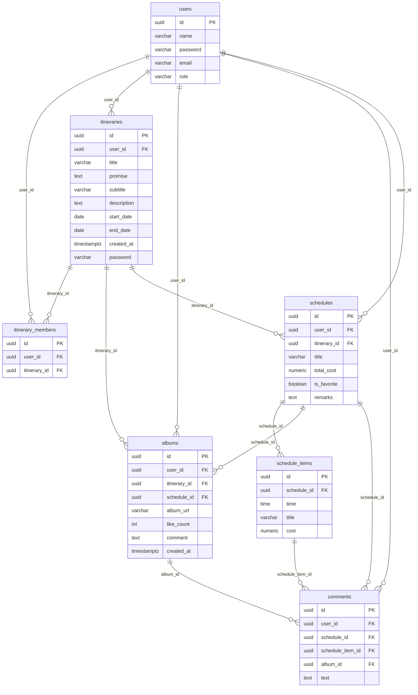
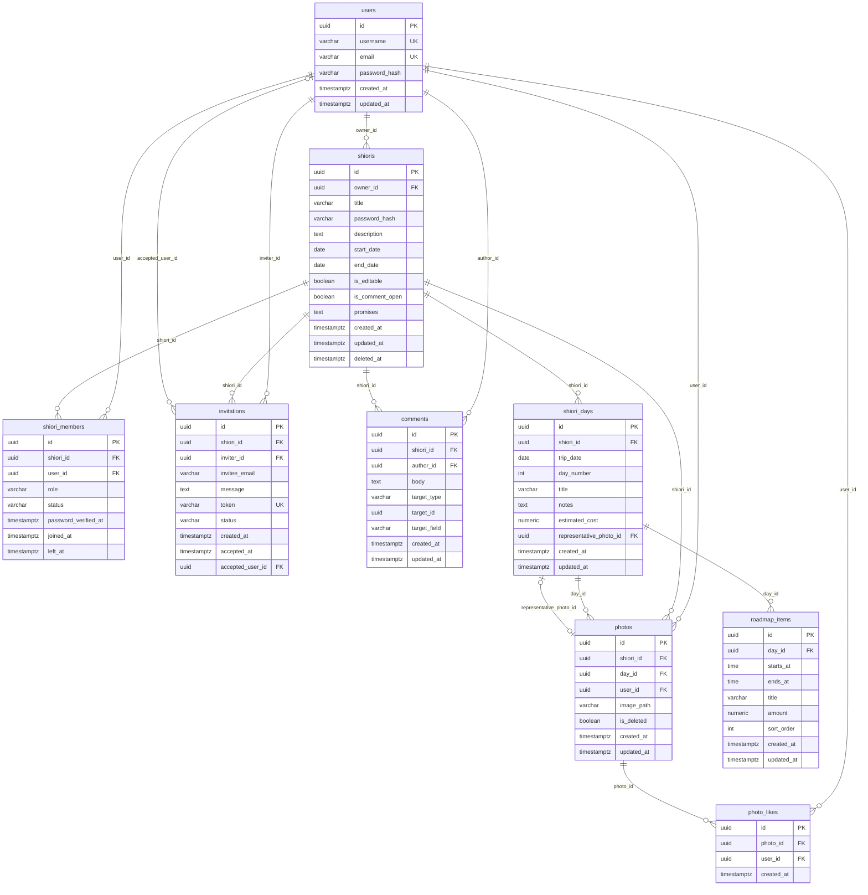

# 旧ER図との差分

このドキュメントは、最初のER図から現行のER設計への変更点をまとめたものです。現行の詳細なテーブル定義は [データベース設計.md](./データベース設計.md)、前提となる要件は [要件定義.md](./要件定義.md) を参照してください。

## もくじ

- [結論](#結論から言うと)
- [テーブル名の対応](#テーブル名の対応)
- [変更前のER図](#変更前のer図)
- [変更後のER図](#変更後のer図)
- [具体的にどこが違う？](#具体的にどこが違う)
  - [users.role ではしおり単位の権限が持てない](#usersrole-ではしおり単位の権限が持てない)
  - [itinerary_members が FK の組だけ](#itinerary_members-が-fk-の組だけ)
  - [invitations が無い](#invitations-が無い)
  - [schedules.user_id で日次が個人所有になる](#schedulesuser_id-で日次が個人所有になる)
  - [comments の対象が日・予定・写真だけ](#comments-の対象が日予定写真だけ)
  - [いいねが like_count だけ](#いいねが-like_count-だけ)
  - [写真に UNIQUE も削除フラグも無い](#写真に-unique-も削除フラグも無い)
  - [password が平文に見える](#password-が平文に見える)
  - [編集権限・コメント解放が無い](#編集権限コメント解放が無い)
  - [updated_at / deleted_at が無い](#updated_at--deleted_at-が無い)
- [削除・移動したカラム](#削除移動したカラム)
- [まとめ](#まとめ)

---

## 結論

最初のER図の骨格（users / itineraries / members / schedules / schedule_items / albums / comments）自体はおおむね妥当で、現在もベースとして活かしている。

足りなかったのは正規化の粒度ではなく、**カラムの置き場所が要件とズレていた**こと。

1. 権限を `users.role` ではなく、しおり単位（`owner_id`）に移した
2. 参加を boolean じゃなく、`status`（active / left / banned）と招待前状態に分けた
3. コメントをセクション単位じゃなく、`target_type` + `target_id` + `target_field` で要素単位にした
4. いいねを `like_count` じゃなく、押下1回＝1行の `photo_likes` にした（同一ユーザーの連打可。写真合計上限999）

テーブル数が足りなかったというよりも、画面を実装しようとしたときに「**このカラム設計だと必要な制約が書けない**」ケースが増えてきた、というのが主な差分。

---

## テーブル名の対応

| 旧                   | 新                | 役割     | 主な差分                                            |
| ------------------- | ---------------- | ------ | ----------------------------------------------- |
| `users`             | `users`          | アカウント  | `role` を外す。`name` → `username`                  |
| `itineraries`       | `shioris`        | しおり    | `owner_id`、編集/コメントフラグ、論理削除                      |
| `itinerary_members` | `shiori_members` | 参加     | `status` / `role` / 初回パスワード確認                   |
| `schedules`         | `shiori_days`    | ◯日目    | `user_id` を外す。`trip_date` / `day_number` / 代表写真 |
| `schedule_items`    | `roadmap_items`  | 時刻つき予定 | ほぼ同じ                                            |
| `albums`            | `photos`         | 写真     | `like_count` と `comment` を分離。`is_deleted`       |
| `comments`          | `comments`       | コメント   | nullable FK 3本 → ポリモーフィック                       |
| （なし）                | `invitations`    | 招待     | 新設                                              |
| （なし）                | `photo_likes`    | いいね    | 新設                                              |

---

## 変更前のER図

## 変更後のER図

詳細は [データベース設計.md](./データベース設計.md)。

---

## 具体的にどこが違う？

単にテーブル数を増やしたという話ではなく、「**旧ER図のこのカラム設計だと、この要件に対応する制約が書けない**」という点を整理したもの。

まず、主な論点は次の10個です。

1. `users.role` ではしおり単位の権限が持てない
2. `itinerary_members` が FK の組だけ
3. `invitations` が無い
4. `schedules.user_id` で日次が個人所有になる
5. `comments` の対象が日・予定・写真だけ
6. いいねが `like_count` だけ
7. 写真に UNIQUE も削除フラグも無い
8. `password` が平文に見える
9. 編集権限・コメント解放が無い
10. `updated_at` / `deleted_at` が無い

---

### 1. `users.role` ではしおり単位の権限が持てない

旧: `users.role`。ユーザー全体のロール。  
新: ロールはユーザーに持たない。`shioris.owner_id` と `shiori_members.role`。

同じユーザーが、しおりAでは作成者、しおりBでは一般、があり得る。グローバル `role` だとそれが表せない。

管理画面・`is_editable`・`is_comment_open`・代表写真の選定は、全部「そのしおりの作成者」の操作。  
権限のスコープがしおりなので、カラムもしおり側に置く。

| 旧                     | 新                  |
| --------------------- | ------------------ |
| `users.role`          | 削除                 |
| `itineraries.user_id` | `shioris.owner_id` |

作成者は `shiori_members` にも `role = owner` で入れる。メンバー一覧から漏れないようにするため。

---

### 2. `itinerary_members` が FK の組だけ

旧カラムは `user_id` と `itinerary_id` だけ。行の有無 = 参加中、というモデル。

| 要件           | 旧で起きること                                          |
| ------------ | ------------------------------------------------ |
| 退出           | DELETE するしかない。再参加・履歴が残らない                        |
| BAN          | 退出と区別できない。再加入拒否も書けない                             |
| 加入の打刻        | `joined_at` が無い                                  |
| パスワード確認は初回のみ | 確認済みフラグが無い                                       |
| メンバー一覧       | owner が `itineraries.user_id` にしかいなくて、JOIN から漏れる |

新は行を消さず `status`（`active` / `left` / `banned`）で持つ。加えて `role`、`password_verified_at`、`joined_at`、`left_at`。`(shiori_id, user_id)` の UNIQUE は維持して、再参加は status を戻す。

---

### 3. `invitations` が無い

招待受領画面は、まだ `shiori_members` にいない相手に出す。

- しおりタイトル
- 招待文言（空なら定型文）
- パスワード
- 加入ボタン

旧ER図は参加後の中間テーブルしかないので、未加入の招待・未登録メール・`token` 付きURLの置き場が無い。加入確定で初めてメンバー行を INSERT する。

---

### 4. `schedules.user_id` で日次が個人所有になる

旧 `schedules.user_id` は、日次ページをユーザー所有にしてしまう。要件の◯日目は期間から自動生成する **しおり共有リソース**。人数分のページが立つと「期間で自動配置」と矛盾する。

旧に無いもの:

- 実日付（`trip_date`）
- ◯日目（`day_number`）

期間変更でどの日を足す・削るかのキーが日付しかない。

`is_favorite` も要件に無い。代表にしたいのは日ではなくその日の写真1枚なので、`representative_photo_id` に移した。

| 旧                       | 新                          |
| ----------------------- | -------------------------- |
| `schedules.user_id`     | 削除。日次の所有者はしおり              |
| `schedules.is_favorite` | 削除。代表写真で代替                 |
| （日付なし）                  | `trip_date` / `day_number` |

---

### 5. `comments` の対象が日・予定・写真だけ

旧は nullable FK を3本。

- `schedule_id`
- `schedule_item_id`
- `album_id`

これだと、しおりタイトル・タイトル補足・期間・お約束・日タイトル・備考・概算・代表写真にコメントできない。タイトルと補足は同じ `itineraries` 行の別カラムなので、FK を足す方式だと対象のたびに列が増える。

新はポリモーフィック。

| カラム            | 役割         | 21時の予定の例              |
| -------------- | ---------- | --------------------- |
| `target_type`  | 対象テーブル     | `roadmap_item`        |
| `target_id`    | 対象行        | その `roadmap_items.id` |
| `target_field` | 同一行のどのカラムか | 予定は行ごとなので `NULL`      |

`albums.comment` は写真1枚にコメント1本。スレッドにならないので `comments` に統合した。`target_id` に複数テーブル向けの実FKは張れない点は、アプリ or トリガーで担保する。

---

### 6. いいねが `like_count` だけ

旧 `albums.like_count` は集計値のキャッシュ。誰が何回押したかが残らない。

要件は「参加メンバーが同一写真に何度でもいいねでき、写真1枚の合計上限は999」。  
新は `photo_likes` に押下1回＝1行を INSERT し、件数は `COUNT(*)`。上限999はアプリで拒否する。

---

### 7. 写真に UNIQUE も削除フラグも無い

要件:

- 1日1人1枚 → `UNIQUE (day_id, user_id)`
- 削除時は黒い画像に置き換わる → 行は残して `is_deleted = true`

旧 `albums` はどちらも無い。DELETE すると枠が消えて黒画像の置き場が無くなる。差し替えは同じ行の `image_path` を UPDATE する。

---

### 8. `password` が平文に見える

旧: `users.password` / `itineraries.password`。  
新: `password_hash`。

英数字10文字以上はアプリのバリデーション。ハッシュ後は文字種を検証できない。しおり削除時の照合もハッシュ同士。

---

### 9. 編集権限・コメント解放が無い

要件は作成者（管理者）だけが切り替える。

- しおり編集の ON/OFF
- コメントの解放 / 未解放

旧 `itineraries` に相当カラムが無い。新は `shioris.is_editable` / `shioris.is_comment_open`。

---

### 10. `updated_at` / `deleted_at` が無い

旧しおりは `created_at` のみ。一覧の作成順には足りるが、タイトル・補足・期間・パスワード変更の保存と、しおり削除後の非表示が書けない。

新は `updated_at` と `deleted_at`（論理削除）。

---

## 削除・移動したカラム

| 旧                                      | 判断                                          |
| -------------------------------------- | ------------------------------------------- |
| `users.role`                           | しおり単位の `owner_id` / `shiori_members.role` へ |
| `itineraries.subtitle` と `description` | タイトル補足は1つ。`description` に寄せる                |
| `schedules.user_id`                    | 日次はしおり共有                                    |
| `schedules.is_favorite`                | 要件なし。`representative_photo_id` で代替          |
| `albums.like_count`                    | `photo_likes` から COUNT                      |
| `albums.comment`                       | `comments` に統合                              |

エンティティを捨てたわけではない。共有しおりとして矛盾するカラムを外して、状態・招待・要素コメント・いいね行を足した。

---

## まとめ

- 権限はユーザーグローバルではなく **しおり単位**
- 参加は行削除ではなく `**status**`
- 招待はメンバー行の前段として `**invitations**`
- ◯日目はユーザー所有ではなく **しおりから生成する共有行**
- コメントは nullable FK の増殖ではなく `**target_type` / `target_id` / `target_field**`
- 写真は `**UNIQUE (day_id, user_id)` + `is_deleted**`、いいねは押下ログの `**photo_likes**`（合計上限999）

カラム定義と制約の詳細は [データベース設計.md](./データベース設計.md)。